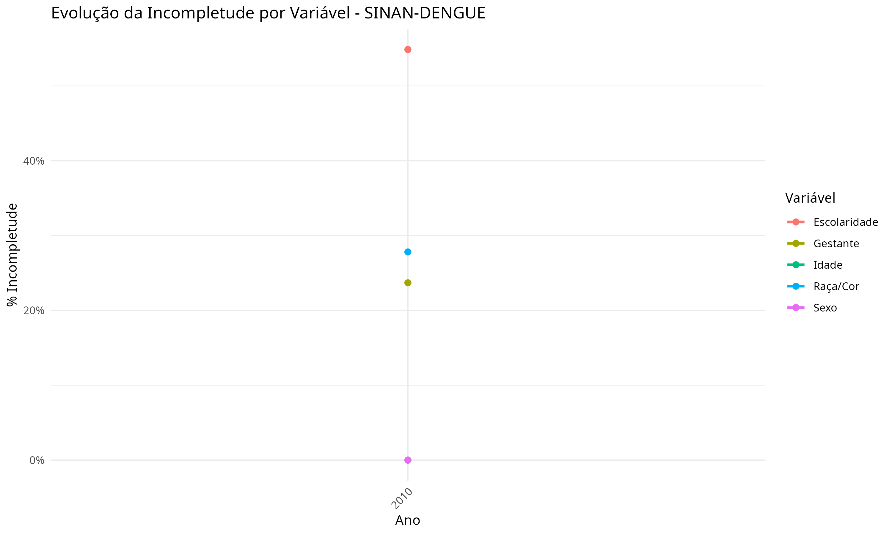

**Bernardo Vergara**^1^ — ORCID: [informar ORCID]

**Djalma Barbosa**^2^ — ORCID: https://orcid.org/0000-0002-6143-7543

^1^ Universidade Federal de Rondonópolis, Instituto de Ciências Humanas e Sociais, Rondonópolis, Mato Grosso, Brasil

^2^ Universidade Federal de Rondonópolis, Faculdade de Ciências Aplicadas e Políticas, Rondonópolis, Mato Grosso, Brasil

**Autor correspondente:** Bernardo Vergara — [informar endereço institucional completo e CEP] — bernardovergara789@gmail.com

## Resumo

**Objetivo:** Analisar a completude dos dados do Sinan referentes à dengue, chikungunya e zika no estado de Mato Grosso. **Método:** Estudo descritivo de 582.793 casos notificados, sendo 422.823 casos de dengue (2010-2025), 115.159 de chikungunya (2014-2025) e 44.811 de zika (2015-2025). Foram analisadas as variáveis escolaridade, raça/cor, gestante, sexo e idade, classificadas pelo escore de Romero e Cunha. **Resultados:** Idade apresentou incompletude nula e sexo, incompletude próxima de zero. Escolaridade registrou os maiores percentuais nas três doenças, com escores entre regular e muito ruim. Raça/cor mostrou melhoria mais evidente para dengue e oscilações sem tendência definida para chikungunya e zika. Gestante apresentou incompletude não nula, com maior percentual observado em dengue. **Conclusão:** A qualidade dos dados é heterogênea, com fragilidades persistentes nos campos sociodemográficos, reforçando a necessidade de monitoramento sistemático e capacitação continuada dos profissionais de saúde.

**Palavras-chave:** Infecções por Arbovirus; Doenças Negligenciadas; Serviços de Vigilância Epidemiológica; Confiabilidade dos Dados; Sistemas de Informação em Saúde.

## Introdução

As arboviroses integram o conjunto de Doenças Tropicais Negligenciadas (DTN), que afetam de forma desproporcional populações pobres e vulnerabilizadas em regiões tropicais e subtropicais, especialmente em países em desenvolvimento [1-3]. No Brasil, essas doenças apresentam ampla distribuição geográfica, diferentes padrões de endemicidade e impactos relevantes sobre os serviços de saúde [4].

A vigilância epidemiológica dessas enfermidades depende da qualidade dos dados registrados nos sistemas de informação em saúde. No Brasil, o Sistema de Informação de Agravos de Notificação (Sinan) constitui o principal instrumento de coleta e processamento de dados sobre doenças e agravos de notificação compulsória [5]. Dados completos e consistentes são necessários para estimar a magnitude dos agravos, orientar ações de prevenção e controle, subsidiar o planejamento de políticas públicas e apoiar a alocação de recursos [6].

A completude (ou completitude) é um atributo da análise da qualidade dos dados, referente ao grau em que registros apresentam valores preenchidos ou não nulos [7]. A análise deste atributo é fundamental para assegurar a confiabilidade das investigações epidemiológicas e para orientar, de maneira adequada, o planejamento e a tomada de decisões em saúde pública.

No Brasil, a avaliação da qualidade dos dados produzidos pelos Sistemas de Informação em Saúde (SIS) não ocorre de forma sistemática ou segundo um plano de monitoramento padronizado pelo Ministério da Saúde. Como consequência, as iniciativas de análise e controle da qualidade desses dados tendem a ser pontuais e pouco articuladas entre si [8]. Essa lacuna é particularmente relevante no contexto das DTN, doenças que já sofrem historicamente com subnotificação e invisibilidade nas agendas de saúde pública.

Apesar da relevância das arboviroses para a saúde pública, a literatura sobre completude de dados do Sinan ainda se concentra em agravos específicos ou em avaliações pontuais de dengue [18,20], havendo menor acúmulo de evidências comparativas para dengue, chikungunya e zika em uma mesma unidade federativa e em série temporal ampla. Essa limitação reduz a capacidade de identificar quais variáveis permanecem mais vulneráveis ao não preenchimento e se os padrões observados são semelhantes entre arboviroses com diferentes períodos de incorporação à vigilância.

O estado de Mato Grosso está localizado na região Centro-Oeste do Brasil e é composto por 141 municípios, com população estimada em aproximadamente 3,6 milhões de habitantes para 2024. O estado apresenta condições climáticas favoráveis à proliferação do *Aedes aegypti*, vetor das arboviroses estudadas, com temperaturas elevadas e períodos chuvosos prolongados, tornando-o uma área de relevância epidemiológica para a vigilância dessas doenças.

Diante desse contexto, o objetivo deste estudo foi analisar a incompletude dos dados de dengue, chikungunya e zika registrados no Sinan em Mato Grosso, no período de 2010 a 2025, com ênfase em variáveis sociodemográficas e campos obrigatórios relevantes para a vigilância epidemiológica.

## Métodos

### Delineamento e fonte dos dados

Trata-se de estudo descritivo sobre a incompletude dos registros de dengue, chikungunya e zika notificados no Sinan em Mato Grosso. O período analisado abrangeu todos os anos disponíveis para cada arbovirose no pipeline de extração: 2010 a 2025 para dengue, 2014 a 2025 para chikungunya e 2015 a 2025 para zika.

Os dados foram obtidos do DATASUS [10] por meio do pacote microdatasus [11] e processados na linguagem de programação R [9]. O recorte geográfico foi operacionalizado a partir do campo `SG_UF_NOT`, correspondente à unidade federativa de notificação. O código de extração, processamento e geração das tabelas e figuras está disponível em repositório público [12].

### Variáveis e critérios de incompletude

Foram analisadas as variáveis idade (`NU_IDADE_N`), sexo (`CS_SEXO`), gestante (`CS_GESTANT`), raça/cor (`CS_RACA`) e escolaridade (`CS_ESCOL_N`). Idade, sexo e gestante foram tratadas como variáveis obrigatórias; raça/cor e escolaridade, como variáveis essenciais.

A incompletude foi calculada como o percentual de registros ausentes, ignorados ou incorretamente preenchidos em relação ao total de notificações analisadas em cada ano e sistema de informação. Para idade, considerou-se incompleto o registro sem valor preenchido. Para sexo, consideraram-se incompletos os registros sem valor preenchido ou marcados como "Ignorado". Para gestante, o numerador de incompletude foi restrito aos registros com sexo feminino, considerando-se incompletos os campos sem valor preenchido, "Ignorado" ou "Não se aplica". Para raça/cor, consideraram-se incompletos os registros sem valor preenchido ou marcados como "Ignorado". Para escolaridade, consideraram-se incompletos os registros sem valor preenchido, "Não se aplica" ou codificados como "09".

### Classificação e análise

Para classificar a incompletude, adotou-se o escore proposto por Romero e Cunha [13,14]: excelente (≤ 5%); bom (> 5% a 10%); regular (> 10% a 20%); ruim (> 20% a 50%); e muito ruim (> 50%). As análises foram realizadas separadamente por arbovirose, ano de notificação e variável. Os resultados foram apresentados por meio de frequências, percentuais, valores mínimos, médios e máximos de incompletude e gráficos de série temporal.

## Resultados

A análise da incompletude dos dados registrados no Sinan para dengue, chikungunya e zika revelou padrões distintos entre as variáveis investigadas, com variações ao longo do tempo. Foram contabilizados 582.793 casos notificados em Mato Grosso no período analisado, dos quais 422.823 (72,6%) de dengue, no período de 2010 a 2025; 115.159 (19,8%) de chikungunya, de 2014 a 2025; e 44.811 (7,7%) de zika, de 2015 a 2025.

De modo geral, as variáveis idade e sexo apresentaram incompletude próxima de zero em todos os anos e para as três arboviroses, comportamento compatível com o caráter obrigatório desses campos no sistema. As variáveis escolaridade e raça/cor apresentaram os maiores percentuais de incompletude e trajetórias oscilantes ao longo do período analisado. A variável gestante, embora obrigatória, também registrou incompletude não nula em determinados períodos (Figura 1). A síntese dos valores mínimos, médios e máximos de incompletude por sistema e variável é apresentada na Tabela 1.

Entre os registros de dengue (Figura 2), a escolaridade apresentou os maiores percentuais de incompletude. No início do período, os valores atingiram 39,5% em 2010 e 40,2% em 2011, ambos classificados como ruins. Houve queda até 2013 (22,0%), nova elevação em 2014 (33,5%) e variação entre 16,0% e 23,0% de 2015 a 2022, exceto em 2018, quando o percentual foi de 31,1%. Em 2023 e 2025, os valores foram de aproximadamente 31,0% e 29,0%, respectivamente, ambos classificados como ruins.

A variável raça/cor apresentou elevação da incompletude nos anos iniciais, passando de 18,4% em 2010 (regular) para 47,5% em 2014 (ruim), com tendência de redução progressiva a partir de então. A partir de 2016, os valores recuaram para a faixa de 7,9-13,9% (bom a regular). Registrou-se aumento abrupto em 2023, com 20,3% (ruim), seguido de queda para 7% (bom) em 2024 e 4,6% (excelente) em 2025.

A variável gestante teve aumento de 2010 a 2014 (16,4% a 34,6%), com classificação entre regular e ruim, seguido de redução até 2017 (12,6%, regular). Em seguida, registrou 19,3% em 2018, 16,6% em 2022 e 22,7% em 2023, permanecendo no escore ruim em parte da série.

Para a chikungunya no período de 2014 a 2025 (Figura 3), houve 115.159 notificações. A escolaridade foi novamente a variável com maior incompletude, atingindo pico máximo em 2018 (46,9%, ruim). Os valores já eram elevados em 2014 (28,6%, ruim), 2015 (26,7%, ruim) e 2016 (18%, regular), sendo que, após 2018, observou-se redução com estabilização entre 13,3% e 20,8% (regular e ruim) nos anos seguintes. Em 2024, houve nova elevação para 28,2% (ruim), seguida de queda para 20,2% em 2025.

A variável raça/cor oscilou entre 2,1% (excelente) e 14,3% (regular) sem tendência clara de melhoria ou piora, mantendo-se predominantemente com escore bom. A variável gestante manteve-se entre 0% (excelente) e 18,6% (regular), com leve elevação em 2023 (18,6%) e posterior estabilização.

Os dados de zika cobrem o período de 2015 a 2025 (Figura 4), com 44.811 notificações. A variável escolaridade apresentou os maiores percentuais de incompletude entre as três arboviroses analisadas, variando entre 21,4% e 55,7%, com escore entre ruim e muito ruim ao longo do período. Os valores mais elevados foram registrados em 2015 (55,7%, muito ruim), 2018 (45,8%, ruim) e 2023 (49,0%, ruim), enquanto o menor percentual foi observado em 2025 (21,4%, ruim).

A variável gestante oscilou entre 9,8% (bom) e 28,3% (ruim), com picos em 2015, 2018, 2019 e 2023 (28,3%, 23,1%, 23,2% e 23,1%, respectivamente). A variável raça/cor apresentou incompletude entre 0,5% (excelente) e 30,5% (ruim), com trajetória irregular e valores classificados como ruim em 2015 (30,5%), como regular nos anos de 2016 (9,8%), 2019 (10,1%), 2020 (12,4%) e 2023 (10,3%) e o restante como excelente. As variáveis sexo e idade permaneceram com incompletude igual a zero ao longo de toda a série.

## Discussão

A análise da incompletude dos registros de dengue, chikungunya e zika no Sinan em Mato Grosso mostrou qualidade heterogênea dos dados, com melhor desempenho para idade e sexo e fragilidades persistentes em variáveis sociodemográficas, especialmente escolaridade. Esse padrão sugere que a obrigatoriedade formal de alguns campos favorece maior preenchimento, enquanto variáveis essenciais, embora epidemiologicamente relevantes, permanecem mais vulneráveis ao não registro.

As variáveis idade e sexo apresentaram incompletude essencialmente nula em todas as doenças e ao longo da série histórica, resultado compatível com os mecanismos de preenchimento obrigatório do Sinan. A estabilidade desses campos também indica que, para as variáveis de identificação básica analisadas, a base utilizada apresentou baixo volume de registros ausentes. Ainda assim, esse achado não permite concluir sobre outras dimensões da qualidade dos dados, como acurácia, consistência interna ou oportunidade da notificação.

Em contraste, escolaridade e raça/cor apresentaram maiores percentuais de incompletude. Problemas semelhantes no preenchimento de variáveis sociodemográficas foram identificados em estudos sobre tuberculose no Sinan, tanto em municípios de alta carga da doença no Brasil [17] quanto no Paraná [19]. Esse conjunto de evidências indica que a fragilidade no preenchimento desses campos não se limita às arboviroses, podendo refletir dificuldades mais amplas nos processos de registro e valorização da informação sociodemográfica nos serviços de vigilância. Considerando que escolaridade e raça/cor são dimensões relevantes para a análise de desigualdades em saúde, sua ausência nos registros limita a capacidade de caracterizar populações mais vulneráveis e de orientar respostas mais equitativas [4,6].

A escolaridade foi a variável com pior desempenho nas três arboviroses, sem atingir escore bom ou excelente em nenhum dos anos analisados. Resultado semelhante foi identificado por Andrade [15] para a tuberculose em Parnamirim, Rio Grande do Norte, com queda da completude desse campo de 66,7% em 2017 para 28,5% em 2018, e por Malhão et al. [17], que apontaram a escolaridade entre as variáveis com maiores percentuais de não preenchimento nos municípios de maior carga de tuberculose no Brasil entre 2001 e 2006. Uma explicação plausível é que esse campo seja percebido como menos prioritário durante o atendimento ou a notificação, especialmente quando comparado a informações clínicas e de identificação imediata. Essa hipótese reforça a necessidade de capacitação continuada das equipes e de rotinas que mostrem a utilidade prática dessas variáveis para o planejamento em saúde.

Os maiores percentuais de incompletude em alguns anos coincidiram com períodos de maior volume de notificações, como observado para a dengue em 2011 e 2023 e para a chikungunya em 2018. Estudos sobre dengue também apontaram pior preenchimento em contextos de maior demanda assistencial ou de pressão sobre a vigilância [18,20]. No presente estudo, contudo, essa relação deve ser interpretada com cautela, pois não foram realizadas análises específicas para testar associação entre volume de casos, ocorrência de epidemias e incompletude. Ainda assim, os achados sugerem que a qualificação do registro deve ser planejada também para períodos de alta demanda, quando campos considerados menos urgentes podem receber menor atenção.

A incompletude da variável gestante merece atenção particular. Embora seja um campo obrigatório, foram observados percentuais não nulos nas três arboviroses, possivelmente relacionados ao uso das opções "Ignorado" ou "Não se aplica". Esse resultado é especialmente relevante no contexto da zika, dada sua associação com síndrome congênita e a importância do monitoramento de gestantes para a vigilância de malformações fetais. A persistência de lacunas nesse campo indica que a obrigatoriedade no sistema não garante, isoladamente, preenchimento informativo e adequado.

A variável raça/cor apresentou melhora mais evidente para dengue, atingindo escore excelente em 2025, enquanto chikungunya e zika mantiveram trajetórias mais irregulares. Esse padrão pode indicar diferenças entre os fluxos de vigilância de cada agravo, maturidade dos processos de notificação ou variações no volume de casos ao longo do tempo. Como este estudo não avaliou diretamente processos de trabalho, capacitações ou mudanças operacionais no Sinan, essas interpretações devem ser entendidas como hipóteses para investigações futuras.

A comparação entre as três arboviroses mostrou que a zika apresentou os maiores percentuais de incompletude de escolaridade, inclusive com classificação muito ruim no primeiro ano da série. Esse achado pode estar relacionado ao período de implantação e consolidação da vigilância da doença, mas também pode refletir diferenças no perfil dos registros, na dinâmica de notificação ou na carga de trabalho dos serviços em anos específicos. Estudos adicionais, com análise municipal e avaliação de processos de vigilância, poderiam esclarecer melhor esses mecanismos.

Este estudo apresenta limitações. Primeiro, a análise utilizou dados secundários do Sinan, sujeitos a subnotificação, erros de digitação, atrasos de atualização e mudanças operacionais no sistema ao longo do tempo. Segundo, avaliou-se apenas a incompletude, sem mensurar outras dimensões da qualidade da informação, como consistência, validade, duplicidade, oportunidade ou acurácia diagnóstica. Terceiro, o recorte geográfico foi baseado na unidade federativa de notificação, o que pode não corresponder integralmente ao local de residência dos casos. Quarto, os dados de 2025 podem estar sujeitos a atualização posterior, devendo ser interpretados como retrato da base disponível no momento da extração. Por fim, o desenho descritivo não permite atribuir causalidade às oscilações temporais observadas.

No conjunto, os resultados indicam que a qualidade dos dados das arboviroses no Sinan em Mato Grosso é heterogênea entre variáveis, doenças e períodos, com fragilidades persistentes em campos sociodemográficos essenciais. A verificação periódica da incompletude, a emissão de relatórios de acompanhamento e a retroalimentação dos serviços municipais e estaduais devem integrar a rotina da vigilância epidemiológica. Além disso, a capacitação continuada dos profissionais de saúde deve enfatizar não apenas a obrigatoriedade do preenchimento, mas o valor epidemiológico das informações registradas para o planejamento, o monitoramento das desigualdades e o fortalecimento das ações de vigilância das arboviroses no estado.

## Contribuição dos autores

Vergara B contribuiu com a curadoria dos dados, o desenvolvimento do código de análise, a análise e interpretação dos dados e a redação do manuscrito. Barbosa D contribuiu com a concepção e o delineamento do estudo, a análise e interpretação dos dados, a supervisão e a revisão crítica do conteúdo intelectual. Todos os autores aprovaram a versão final do manuscrito e são responsáveis por todos os seus aspectos, incluindo a garantia de sua precisão e integridade.

Taxonomia CRediT: Vergara B — Software, Curadoria de dados, Análise formal, Visualização, Investigação, Redação (rascunho original). Barbosa D — Conceituação, Metodologia, Supervisão, Redação (revisão e edição).

## Conflitos de interesse

Os autores declaram não haver conflitos de interesse.

## Financiamento

O presente trabalho foi realizado com apoio da Universidade Federal de Rondonópolis, por meio do Edital nº 8/PROPGP/2025-PIBIC-Af, dos Programas Institucionais de Iniciação Científica e de Iniciação em Desenvolvimento Tecnológico e Inovação (2025-2026).

## Aspectos éticos

| Item | Descrição |
| --- | --- |
| Apreciação por CEP | Dispensada |
| Justificativa | Estudo baseado exclusivamente em dados secundários de domínio público e irrestrito, sem identificação nominal dos sujeitos, obtidos do DATASUS/Sinan |
| Base normativa | Resolução CNS nº 510/2016, que exclui da obrigatoriedade de registro e avaliação pelo sistema CEP/CONEP as pesquisas que utilizam informações de domínio público |

## Registro do protocolo

Não se aplica. O estudo não constitui ensaio clínico nem revisão sistemática, não havendo registro prévio de protocolo em plataforma específica.

## Disponibilidade de dados

Os bancos de dados utilizados nesta pesquisa são de domínio público e estão disponíveis na plataforma do Departamento de Informática do Sistema Único de Saúde [10], compreendendo registros do período de 2010 a 2025. A extração dos dados foi realizada por meio do pacote microdatasus [11], desenvolvido para a linguagem R, que permite o acesso programático e a leitura dos arquivos de domínio público do DATASUS.

O banco de dados está disponível em: https://datasus.saude.gov.br/

Os códigos de análise estão disponíveis em: https://github.com/bernardovergara/IC-Completitude-Dados-Sinan-Arboviroses-MT/tree/submissao-RESS

## Uso de inteligência artificial generativa

Declaramos o uso de tecnologia assistida por inteligência artificial na elaboração deste manuscrito. A ferramenta Claude Anthropic (https://claude.ai/) foi utilizada exclusivamente como auxílio à escrita, contribuindo para o uso de conectivos e para o aprimoramento da coesão e da coerência textual. Em nenhum momento a ferramenta foi empregada para pesquisa, seleção ou indicação de referências bibliográficas. Todas as referências citadas neste estudo foram levantadas e verificadas em texto completo pelos autores, que também conferiram cada citação para assegurar a acurácia e a originalidade das afirmações apresentadas.

## Referências

1. Hotez PJ, Fenwick A, Sachs SE. Control of Neglected Tropical Diseases. N Engl J Med. 2007;357(10):1018-27. https://doi.org/10.1056/NEJMra064142

2. LaBeaud AD. Why Arboviruses Can Be Neglected Tropical Diseases. PLoS Negl Trop Dis. 2008;2(6):e247. https://doi.org/10.1371/journal.pntd.0000247

3. Hotez PJ, Aksoy S, Brindley PJ, Kamhawi S. What constitutes a neglected tropical disease? PLoS Negl Trop Dis. 2020;14(1):e0008001. https://doi.org/10.1371/journal.pntd.0008001

4. Martins-Melo FR, Carneiro M, Ramos AN, Heukelbach J, Ribeiro ALP, Werneck GL. The burden of Neglected Tropical Diseases in Brazil, 1990-2016: a subnational analysis from the Global Burden of Disease Study 2016. PLoS Negl Trop Dis. 2018;12(6):e0006559. https://doi.org/10.1371/journal.pntd.0006559

5. Brasil. Ministério da Saúde. Sistema Nacional de Vigilância em Saúde: relatório de situação: Mato Grosso. Brasília: Ministério da Saúde; 2007. (Série C. Projetos, Programas e Relatórios).

6. Chiavegatto Filho ADP. Uso de big data em saúde no Brasil: perspectivas para um futuro próximo. Epidemiol Serv Saude. 2015;24(2):325-32. https://doi.org/10.5123/S1679-49742015000200015

7. Correia LOS, Padilha BM, Vasconcelos SML. Métodos para avaliar a completitude dos dados dos sistemas de informação em saúde do Brasil: uma revisão sistemática. Cien Saude Colet. 2014;19(11):4467-78. https://doi.org/10.1590/1413-812320141911.02822013

8. Lima CRA, Schramm JMA, Coeli CM, Silva MEM. Revisão das dimensões de qualidade dos dados e métodos aplicados na avaliação dos sistemas de informação em saúde. Cad Saude Publica. 2009;25(10):2095-109. https://doi.org/10.1590/S0102-311X2009001000002

9. R Core Team. R: a language and environment for statistical computing [Internet]. Vienna: R Foundation for Statistical Computing; 2025 [citado 14 jul 2026]. Disponível em: https://www.R-project.org/

10. Brasil. Ministério da Saúde. DATASUS: Departamento de Informática do Sistema Único de Saúde [Internet]. Brasília: Ministério da Saúde; 2025 [citado 14 jul 2026]. Disponível em: https://datasus.saude.gov.br/

11. Saldanha RF, Bastos RR, Barcellos C. Microdatasus: pacote para download e pré-processamento de microdados do Departamento de Informática do SUS (DATASUS). Cad Saude Publica. 2019;35(9):e00032419. https://doi.org/10.1590/0102-311X00032419

12. Vergara B. Completitude de dados Sinan [Internet]. 2026 [citado 14 jul 2026]. Disponível em: https://github.com/bernardovergara/IC-Completitude-Dados-Sinan-Arboviroses-MT

13. Romero DE, Cunha CB. Avaliação da qualidade das variáveis socioeconômicas e demográficas dos óbitos de crianças menores de um ano registrados no Sistema de Informações sobre Mortalidade do Brasil (1996/2001). Cad Saude Publica. 2006;22(3):673-81. https://doi.org/10.1590/S0102-311X2006000300022

14. Romero DE, Cunha CB. Avaliação da qualidade das variáveis epidemiológicas e demográficas do Sistema de Informações sobre Nascidos Vivos, 2002. Cad Saude Publica. 2007;23(3):701-14. https://doi.org/10.1590/S0102-311X2007000300028

15. Andrade RPS. Completitude do sistema de informação sobre tuberculose no município de Parnamirim/RN [dissertação na Internet]. Natal: Universidade Federal do Rio Grande do Norte; 2021 [citado 21 out 2025]. Disponível em: https://repositorio.ufrn.br/handle/123456789/32102

16. Damásio GMX, Barbosa CCH, Sesana AG. Completude do sistema de informação de agravos de notificação em tuberculose: um estudo ecológico do período de 2010 a 2019 no Distrito Federal. Programa de Iniciação Científica - PIC/UniCEUB - Relatórios de Pesquisa. 2023. https://doi.org/10.5102/pic.n0.2021.8941

17. Malhão TA, Codennoti S, Oliveira GP. Avaliação da completitude do Sistema de Informação de Agravos de Notificação da tuberculose, Brasil, 2001-2006. Epidemiol Serv Saude. 2010;19(3):245-56. https://doi.org/10.5123/S1679-49742010000300007

18. Marques CA, Siqueira MM, Portugal FB. Avaliação da não completude das notificações compulsórias de dengue registradas por município de pequeno porte no Brasil. Cien Saude Colet. 2020;25(3):891-901. https://doi.org/10.1590/1413-81232020253.16162018

19. Silva MS, Andrade RLP, Arcoverde MAM. Completude do Sistema de Informação em Tuberculose no estado do Paraná, 2008-2017: estudo ecológico. Rev Enferm UERJ. 2020;28:e50372. https://doi.org/10.12957/reuerj.2020.50372

20. Mayer R, Nishida FS. (In)completude das notificações de dengue no sistema de informação de agravos de notificação. Arq Mudi. 2024;1(1):171-4. https://doi.org/10.4025/arqmudi.v1i1.74835



## Tabelas

**Tabela 1.** Incompletude mínima, média e máxima das variáveis analisadas, por sistema de informação, segundo o escore de Romero e Cunha. Mato Grosso, Brasil, 2010-2025 (n = 582.793 registros).

| Sistema | Variável | Mínimo | Média | Máximo | Pior escore |
| --- | --- | --- | --- | --- | --- |
| SINAN-CHIKUNGUNYA | Escolaridade | 13,3% | 22,5% | 46,9% | Ruim |
| SINAN-CHIKUNGUNYA | Gestante | 0,0% | 12,7% | 18,6% | Regular |
| SINAN-CHIKUNGUNYA | Idade | 0,0% | 0,0% | 0,0% | Excelente |
| SINAN-CHIKUNGUNYA | Raça/Cor | 2,1% | 7,5% | 14,3% | Regular |
| SINAN-CHIKUNGUNYA | Sexo | 0,0% | 0,1% | 0,3% | Excelente |
| SINAN-DENGUE | Escolaridade | 16,0% | 25,6% | 40,2% | Ruim |
| SINAN-DENGUE | Gestante | 12,6% | 20,9% | 34,6% | Ruim |
| SINAN-DENGUE | Idade | 0,0% | 0,0% | 0,0% | Excelente |
| SINAN-DENGUE | Raça/Cor | 4,6% | 17,0% | 47,5% | Ruim |
| SINAN-DENGUE | Sexo | 0,0% | 0,0% | 0,1% | Excelente |
| SINAN-ZIKA | Escolaridade | 21,4% | 38,8% | 55,7% | Muito ruim |
| SINAN-ZIKA | Gestante | 9,8% | 18,2% | 28,3% | Ruim |
| SINAN-ZIKA | Idade | 0,0% | 0,0% | 0,0% | Excelente |
| SINAN-ZIKA | Raça/Cor | 0,5% | 8,3% | 30,5% | Ruim |
| SINAN-ZIKA | Sexo | 0,0% | 0,0% | 0,0% | Excelente |

Sinan: Sistema de Informação de Agravos de Notificação. Escore de Romero e Cunha: excelente (≤ 5%); bom (> 5% a 10%); regular (> 10% a 20%); ruim (> 20% a 50%); muito ruim (> 50%).



## Figuras

**Figura 1.** Incompletude agregada das variáveis do Sinan, segundo ano de notificação. Mato Grosso, Brasil, 2010-2025 (n = 582.793 registros).

{#fig-agregado width="17cm"}



**Figura 2.** Incompletude das variáveis do Sinan-Dengue, segundo ano de notificação. Mato Grosso, Brasil, 2010-2025 (n = 422.823 registros).

{#fig-dengue width="17cm"}



**Figura 3.** Incompletude das variáveis do Sinan-Chikungunya, segundo ano de notificação. Mato Grosso, Brasil, 2014-2025 (n = 115.159 registros).

{#fig-chikungunya width="17cm"}



**Figura 4.** Incompletude das variáveis do Sinan-Zika, segundo ano de notificação. Mato Grosso, Brasil, 2015-2025 (n = 44.811 registros).

{#fig-zika width="17cm"}

<!--
=====================================================================
ANOTAÇÕES INTERNAS - NÃO RENDERIZADAS NO .DOCX
Pipeline analítico do repositório. Os microdados já foram baixados;
os chunks abaixo ficam com eval:false + include:false, de modo que a
renderização usa apenas os arquivos locais em data/filtered,
data/processed e plots, sem refazer a extração no DATASUS.

Dependências: tidyverse, microdatasus.
Configuração em config.r: UF = Mato Grosso, período 2010-2025,
sistemas SINAN-DENGUE, SINAN-CHIKUNGUNYA e SINAN-ZIKA.

Para regenerar tudo do zero:
  Rscript pipeline.r
  Rscript source/paper_assets_base.r
  quarto render artigo_reprodutivel.qmd --to docx
=====================================================================
-->

```{r}
#| label: setup-reprodutibilidade
#| eval: false
#| include: false
source("config.r")
source("packages/system_process_mapping.r")
```

```{r}
#| label: download-dengue
#| eval: false
#| include: false
library(tidyverse)
library(microdatasus)

source("config.r")
source("packages/system_process_mapping.r")
codigo_uf <- read_csv("data/utils/uf_ibge_cods.csv")

for (ano in 2010:2025) {
  dados <- fetch_datasus(
    year_start = ano,
    year_end = ano,
    information_system = "SINAN-DENGUE",
    vars = unique(c(filtro, "SG_UF_NOT"))
  )

  dados <- dados |>
    filter(SG_UF_NOT %in% codigo_uf$codigo[codigo_uf$estado %in% "MT"]) |>
    process_by_system("SINAN-DENGUE")

  write_csv(dados, path_dados_filtrados_f("SINAN-DENGUE", "MT", ano))
}
```

```{r}
#| label: download-chikungunya
#| eval: false
#| include: false
library(tidyverse)
library(microdatasus)

source("config.r")
source("packages/system_process_mapping.r")
codigo_uf <- read_csv("data/utils/uf_ibge_cods.csv")

for (ano in 2014:2025) {
  dados <- fetch_datasus(
    year_start = ano,
    year_end = ano,
    information_system = "SINAN-CHIKUNGUNYA",
    vars = unique(c(filtro, "SG_UF_NOT"))
  )

  dados <- dados |>
    filter(SG_UF_NOT %in% codigo_uf$codigo[codigo_uf$estado %in% "MT"]) |>
    process_by_system("SINAN-CHIKUNGUNYA")

  write_csv(dados, path_dados_filtrados_f("SINAN-CHIKUNGUNYA", "MT", ano))
}
```

```{r}
#| label: download-zika
#| eval: false
#| include: false
library(tidyverse)
library(microdatasus)

source("config.r")
source("packages/system_process_mapping.r")
codigo_uf <- read_csv("data/utils/uf_ibge_cods.csv")

for (ano in 2015:2025) {
  dados <- fetch_datasus(
    year_start = ano,
    year_end = ano,
    information_system = "SINAN-ZIKA",
    vars = unique(c(filtro, "SG_UF_NOT"))
  )

  dados <- dados |>
    filter(SG_UF_NOT %in% codigo_uf$codigo[codigo_uf$estado %in% "MT"]) |>
    process_by_system("SINAN-ZIKA")

  write_csv(dados, path_dados_filtrados_f("SINAN-ZIKA", "MT", ano))
}
```

```{r}
#| label: processar-incompletude
#| eval: false
#| include: false
source("source/incompletude_proc.r")
source("source/plot_proc.r")
source("source/paper_assets_base.r")
```
